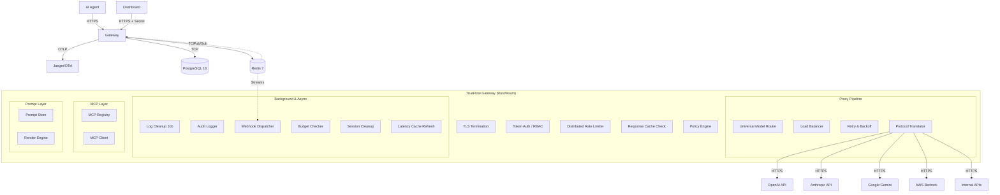

# TrueFlow - System Architecture

> Comprehensive Technical Reference
>
> This document details the internal architecture, data flows, and component design of TrueFlow. It is intended for core contributors, system architects, and advanced operators.

---

## 1. High-Level Design

TrueFlow is a high-performance, security-focused reverse proxy for LLM and API traffic. It sits between AI agents and upstream providers (OpenAI, Anthropic, internal APIs), acting as a centralized control plane for observability, security, and cost management.

### Core Philosophy

1. **Zero Trust**: No request passes without explicit token validation and policy evaluation.
2. **Streaming First**: Usage of `Bytes` and streaming bodies to minimize memory footprint; buffering occurs only when policy inspection requires it.
3. **Hot Path Optimization**: Critical path metadata is cached in-memory (L1) and Redis (L2) to minimize database hits.
4. **Fail-Close**: Security failures (auth, policy errors) always block the request. Network failures (upstream) trigger circuit breaking.

### Technology Stack

| Component | Technology | Purpose |
|-----------|------------|---------|
| Language | Rust | Memory safety, performance, predictable latency |
| Web Framework | Axum | Built on Tower/Hyper for composable middleware |
| Async Runtime | Tokio | High-performance async I/O |
| Database | PostgreSQL 16 | Persistent storage via `sqlx` with compile-time verified queries |
| Cache | Redis 7 | L2 caching, rate limiting, distributed circuit breakers |
| HTTP Client | `reqwest` | Upstream provider calls with connection pooling |
| Tracing | OpenTelemetry | Distributed tracing via OTLP |
| Metrics | Prometheus | `/metrics` endpoint for scraping |

---

## 2. System Diagram



---

## 3. Request Lifecycle (Hot Path)

When a request hits the gateway (e.g., `POST /v1/chat/completions`), it flows through a structured pipeline:

### 3.1 Ingress & Middleware Stack

Requests flow through Tower middleware layers in `src/main.rs`:

1. **Request ID Middleware**: Generates unique `X-Request-Id` header for tracing
2. **Security Headers Middleware**: Injects `Strict-Transport-Security`, `X-Content-Type-Options`, `X-Frame-Options`, `X-XSS-Protection`, `Cache-Control`, `Referrer-Policy`, `Permissions-Policy`
3. **CORS Layer**: Enforces `DASHBOARD_ORIGIN` for browser clients
4. **Body Limit**: 25MB max request body
5. **Trace Layer**: OpenTelemetry span creation

### 3.2 Proxy Handler Pipeline

The main handler (`src/proxy/handler/core.rs`) orchestrates the request:

**Step 1: Header Extraction**
- Extract `Authorization: Bearer tf_v1_...` token
- Extract attribution headers (`X-User-Id`, `X-Tenant-Id`, `X-Session-Id`)
- Extract custom properties (`X-Properties` JSON)
- Parse W3C trace context (`traceparent` header)

**Step 2: Token Resolution**
- Look up virtual token in tiered cache (L1 DashMap + L2 Redis)
- Validate token is active and not expired
- Load attached policy IDs and circuit breaker config

**Step 3: Policy Engine (Pre-Flight)**
- Evaluate policies with `phase: "pre"`
- Actions: deny, rate_limit, redact, transform, require_approval, dynamic_route, split
- Track triggered actions for execution

**Step 4: Guardrail Header Processing**
- Check `X-TrueFlow-Guardrails` header (if enabled per token)
- Modes: `disabled`, `append`, `override`

**Step 5: Spend Cap Check**
- Atomic Redis check for daily/monthly/lifetime caps
- Block with 429 if exceeded

**Step 6: Load Balancer Selection**
- Weighted round-robin within priority tiers
- Circuit breaker health check
- Redis-backed distributed failure tracking

**Step 7: Model Router**
- Detect provider from model name prefix
- Translate request format (OpenAI to Anthropic/Gemini/Bedrock)
- Inject decrypted credential

**Step 8: Upstream Request**
- Forward with retry logic (exponential backoff, jitter)
- Respect `Retry-After` headers
- Handle streaming vs non-streaming

**Step 9: Response Processing**
- Stream passthrough (SSE) or buffer
- Model router response translation
- Policy Engine (Post-Flight)
- Cost calculation
- Audit log write

---

## 4. Component Deep Dive

### 4.1 Policy Engine

**Location**: `src/middleware/engine/`

The policy engine is the brain of TrueFlow. It evaluates declarative JSON-logic rules against request context.

#### Architecture

```rust
pub struct Policy {
    pub id: Uuid,
    pub name: String,
    pub phase: Phase,           // Pre or Post
    pub mode: PolicyMode,       // Enforce or Shadow
    pub rules: Vec<Rule>,
    pub retry: Option<RetryConfig>,
}

pub struct Rule {
    pub when: Condition,        // Recursive condition tree
    pub then: Vec<Action>,      // Actions to execute
    pub async_check: bool,      // Non-blocking evaluation
}
```

#### Phases

| Phase | When | Use Cases |
|-------|------|-----------|
| `Pre` | Before upstream request | Access control, rate limiting, request redaction, routing, approval gates |
| `Post` | After response received | Response redaction, schema validation, logging, alerts |

#### Modes

| Mode | Behavior |
|------|----------|
| `Enforce` | Actions execute; deny blocks requests |
| `Shadow` | Violations logged only; request proceeds (for testing) |

#### Condition Evaluation

Conditions form a recursive tree with AND/OR/NOT logic:

```rust
pub enum Condition {
    All { all: Vec<Condition> },     // AND
    Any { any: Vec<Condition> },     // OR
    Not { not: Box<Condition> },     // Negation
    Check { field, op, value },      // Leaf comparison
    Always { always: bool },         // Catch-all
}
```

#### Operators

12 operators supported: `eq`, `neq`, `gt`, `gte`, `lt`, `lte`, `in`, `glob`, `regex`, `contains`, `starts_with`, `ends_with`, `exists`

#### Security Protections

- **MAX_RECURSION_DEPTH = 100**: Prevents stack overflow from deeply nested conditions
- **ReDoS Protection**: 1MB regex size limit
- **Glob DoS Protection**: 100K iteration limit
- **MED-5 Fix**: Empty conditions treated as denial (safe default)

#### Action Types (20+)

| Action | Phase | Description |
|--------|-------|-------------|
| `Allow` | Any | Explicit allow (no-op) |
| `Deny` | Any | Block with custom status/message |
| `RateLimit` | Pre | Sliding window rate limiting |
| `Throttle` | Pre | Artificial delay |
| `Redact` | Any | PII detection and masking |
| `Transform` | Pre | Header/body modification |
| `Override` | Pre | Force body field values |
| `Log` | Any | Custom log message |
| `Tag` | Any | Add audit log metadata |
| `Webhook` | Any | Fire external webhook |
| `ContentFilter` | Pre | 14 check categories |
| `RequireApproval` | Pre | Human-in-the-loop |
| `Split` | Pre | A/B traffic splitting |
| `DynamicRoute` | Pre | Smart model selection |
| `ConditionalRoute` | Pre | Condition-based routing |
| `ValidateSchema` | Post | JSON Schema validation |
| `ExternalGuardrail` | Any | Azure/AWS/LlamaGuard |
| `ToolScope` | Pre | MCP tool filtering |
| `BudgetAlert` | Post | Spend threshold alerts |

#### Evaluation Order (MED-6)

1. Rules processed in array order
2. Actions within a rule collected in order
3. Policies processed in array order
4. **Deny Short-Circuit (HIGH-4)**: Processing stops immediately on deny

---

### 4.2 Model Router

**Location**: `src/proxy/model_router/`

The model router handles provider detection and format translation.

#### Provider Detection

Auto-detection from model name prefix:

| Prefix | Provider |
|--------|----------|
| `gpt-*`, `o1-*`, `o3-*` | OpenAI |
| `claude-*` | Anthropic |
| `gemini-*` | Google Gemini |
| `bedrock-*` | AWS Bedrock |
| `command-*` | Cohere |
| `mistral-*` | Mistral |
| `groq-*` | Groq |
| `together-*` | Together AI |
| `ollama-*` | Ollama |

#### Request Translation

OpenAI-format requests are translated to native provider formats:

- **Anthropic**: Messages array to `messages`, system prompt handling, tool definition translation
- **Gemini**: `contents` array, `generationConfig`, `systemInstruction`
- **Bedrock**: Converse API format, tool handling

#### Response Translation

Native provider responses translated back to OpenAI format:

- **Anthropic**: `content` blocks to `choices`, usage extraction
- **Gemini**: `candidates` to `choices`, `usageMetadata` mapping
- **Bedrock**: Binary event stream decoding, tool result handling

---

### 4.3 Load Balancer & Circuit Breaker

**Location**: `src/proxy/loadbalancer.rs`

#### Load Balancing Strategies

| Strategy | Description |
|----------|-------------|
| Weighted Round-Robin | Within priority tiers |
| Least Busy | Track in-flight requests per upstream |
| Lowest Latency | Use p50 latency cache (5min refresh) |
| Weighted Random | Random with weights, prevents thundering herd |
| Health-Aware | Skip unhealthy upstreams |

#### Circuit Breaker States

```
Closed (healthy) --> Open (blocked after failures) --> Half-Open (cooldown probe) --> Closed/Open
```

#### Configuration

```json
{
  "enabled": true,
  "failure_threshold": 3,
  "failure_rate_threshold": 0.5,
  "min_sample_size": 10,
  "recovery_cooldown_secs": 30,
  "half_open_max_requests": 1
}
```

#### Distributed State

- Redis-backed failure counters: `cb:{token_id}:{url_hash}:failures`
- Half-open probe limit is instance-local (HIGH-9 limitation)

---

### 4.4 Guardrails Engine

**Location**: `src/middleware/guardrail/`

Built-in safety layer with 100+ pre-built patterns.

#### Content Filter Categories (14)

1. Jailbreak detection (DAN, prompt injection)
2. Harmful content (CSAM, suicide, violence)
3. Code injection (SQL, shell, XSS)
4. Profanity and slurs
5. Bias and discrimination
6. Sensitive topics (medical/legal advice)
7. Gibberish and encoding smuggling
8. Contact information
9. IP leakage
10. Competitor mentions
11. Topic allowlist
12. Topic denylist
13. Custom patterns
14. Content length

#### External Guardrail Vendors

| Vendor | Integration |
|--------|-------------|
| Azure Content Safety | Full API integration |
| AWS Comprehend | Full API integration |
| LlamaGuard | Ollama/vLLM host |
| Palo Alto AIRS | Enterprise integration |
| Prompt Security | Enterprise integration |

---

### 4.5 PII Detection & Redaction

**Location**: `src/middleware/redact.rs`, `src/middleware/pii/`

#### Built-in Patterns

| Pattern | Description |
|---------|-------------|
| SSN | US Social Security Number (MED-14 fix) |
| Email | RFC 5322 compliant |
| Credit Card | With Luhn validation (MED-15) |
| Phone | International formats |
| API Key | Common key prefixes |
| IBAN | International bank accounts |
| DOB | Date of birth formats |
| IPv4 | IP address detection |

#### NLP Backend

Presidio integration for unstructured PII (names, addresses, multilingual entities).

#### Streaming Support

- SSE chunk processing
- UTF-8 boundary handling
- Known limitation: Split-across-chunk PII not detected (documented)

---

### 4.6 Vault (Credential Encryption)

**Location**: `src/vault/builtin.rs`

#### Envelope Encryption Architecture

```
Master Key (KEK)
  - 32-byte key from TRUEFLOW_MASTER_KEY env var
  - Never stored in database
  |
  +-- Data Encryption Key (DEK)
       - Unique 256-bit key per credential
       - Stored encrypted by KEK in PostgreSQL
       |
       +-- Credential
            - Encrypted by DEK using AES-256-GCM
            - Stored as: nonce (12B) + ciphertext + tag
```

#### Security Features

- **CRIT-4**: KEK zeroized on drop
- Per-credential DEK prevents key reuse
- 96-bit random nonce per encryption
- Constant-time key comparison

---

### 4.7 MCP Client & Registry

**Location**: `src/mcp/`

The Model Context Protocol integration enables tool discovery and execution.

#### Registry (`mcp/registry.rs`)

- In-memory `Arc<RwLock<HashMap>>` of connected MCP servers
- Cached tool schemas for injection
- OAuth 2.0 auto-discovery (RFC 9728)

#### Client (`mcp/client.rs`)

- JSON-RPC 2.0 over Streamable HTTP
- Methods: `initialize`, `tools/list`, `tools/call`
- Auth modes: None, Bearer, OAuth 2.0

#### Tool Execution Flow

1. Agent request with `X-MCP-Servers: brave,slack` header
2. Gateway fetches cached tool schemas
3. Tools injected as `mcp__brave__search`, `mcp__slack__send_message`
4. LLM returns `finish_reason: "tool_calls"` for MCP tools
5. Gateway executes via JSON-RPC
6. Result appended to messages, re-sent to LLM
7. Max 10 iterations

---

### 4.8 Prompt Management

**Location**: `src/api/prompt_handlers.rs`

#### Features

- Versioned prompts with immutable history
- Folder organization
- Variable templating (`{{variable}}`)
- Label-based deployment (`production`, `staging`)
- Server-side rendering

#### Workflow

1. Create prompt with slug and folder
2. Publish version with model, messages, parameters
3. Deploy version to label
4. Render at runtime with variable substitution

#### API Endpoints

| Endpoint | Description |
|----------|-------------|
| `GET /prompts` | List prompts (filter by folder) |
| `POST /prompts` | Create prompt |
| `POST /prompts/{id}/versions` | Publish new version |
| `POST /prompts/{id}/deploy` | Deploy version to label |
| `GET /prompts/by-slug/{slug}/render` | Render with variables |

---

### 4.9 Experiment Tracking

**Location**: `src/api/experiment_handlers.rs`

#### Architecture

Experiments are a convenience layer over the `Split` policy action.

#### Creation Flow

1. `POST /experiments` creates experiment record
2. Auto-generates `Split` policy with variant weights
3. Variant selection is deterministic by `request_id`

#### Metrics Tracked

- Request count per variant
- Average latency
- Total cost
- Error rate

---

### 4.10 Realtime WebSocket Proxy

**Location**: `src/proxy/realtime.rs`

#### Purpose

Proxy OpenAI Realtime API WebSocket connections through the gateway.

#### Flow

1. Client connects to `/v1/realtime`
2. Gateway establishes upstream WebSocket
3. Bidirectional message passthrough
4. Token authentication and policy evaluation

---

### 4.11 Rate Limiting

**Location**: `src/cache.rs`

#### Implementation

- Redis-backed sliding window (no 2x burst vulnerability)
- Per-token, per-project, global scopes
- Configurable windows: second, minute, hour, day

#### Key Format

```
rate_limit:{token_id}:{window_type}:{window_value}
```

---

### 4.12 Spend Management

**Location**: `src/middleware/spend.rs`

#### Cap Types

| Period | Redis Key | Description |
|--------|-----------|-------------|
| Daily | `spend:{token_id}:daily:{YYYY-MM-DD}` | Resets daily |
| Monthly | `spend:{token_id}:monthly:{YYYY-MM}` | Resets monthly |
| Lifetime | Database | Never resets |

#### Enforcement

- Atomic Redis Lua script for check-and-increment
- Single-flight pattern (MED-8) prevents thundering herd on cache misses
- Background budget checker job (15min intervals)

---

## 5. Background Jobs

**Location**: `src/jobs/`

| Job | Interval | Purpose |
|-----|----------|---------|
| Cleanup | 1 hour | Expire Level 2 audit logs, strip bodies |
| Approval Expiry | 60 seconds | Expire stale HITL requests |
| Session Cleanup | 15 minutes | Remove orphaned sessions |
| Budget Checker | 15 minutes | Project spend alerts, webhook notifications |
| Latency Cache Refresh | 5 minutes | Recompute p50 latency per model |
| Cache Eviction | 60 seconds | Remove expired L1 entries |
| Key Rotation | 1 hour (configurable) | DEK re-encryption |

---

## 6. Data Architecture

### 6.1 PostgreSQL (System of Record)

**Migrations**: 42 migrations (001-042)

**Key Tables**:

| Table | Purpose |
|-------|---------|
| `organizations` | Multi-tenant root |
| `credentials` | Encrypted API keys |
| `tokens` | Virtual tokens with policy bindings |
| `policies` | Policy definitions with versioning |
| `policy_versions` | Full version history |
| `audit_logs` | Request/response logs (partitioned by month) |
| `approvals` | HITL request queue |
| `sessions` | Multi-turn conversation tracking |
| `api_keys` | Management API access |
| `webhooks` | Event delivery endpoints |
| `mcp_servers` | MCP server registry |
| `prompts` | Prompt templates |
| `prompt_versions` | Prompt version history |
| `experiments` | A/B test tracking |
| `teams` | Organization hierarchy |
| `model_access_groups` | LLM model RBAC |
| `oidc_providers` | SSO/OIDC configurations |
| `spend_caps` | Per-token budget limits |
| `notifications` | In-app alerts |

### 6.2 Redis (System of Speed)

| Namespace | Purpose |
|-----------|---------|
| `cache:*` | Token/policy/credential lookups (TTL 5-10 min) |
| `spend:*` | Atomic spend counters |
| `rate_limit:*` | Sliding window counters |
| `cb:*` | Circuit breaker state |
| `response:*` | LLM response cache |
| `stream:*` | HITL approval queues |

---

## 7. Authentication & Authorization

### 7.1 Authentication Methods

| Method | Header | Role |
|--------|--------|------|
| SuperAdmin | `X-Admin-Key` or `Authorization: Bearer {env_key}` | SuperAdmin |
| API Key | `Authorization: Bearer ak_*` | Admin/Member/ReadOnly |
| OIDC JWT | `Authorization: Bearer {jwt}` | Mapped from claims |

### 7.2 RBAC

| Role | Permissions |
|------|-------------|
| SuperAdmin | Full access (env key only) |
| Admin | Full access within org |
| Member | Read/write, no delete |
| ReadOnly | Read-only access |

### 7.3 Scope System

26 scope namespaces: `tokens:read`, `tokens:write`, `policies:read`, `policies:write`, etc.

Wildcards supported: `*` grants all, `tokens:*` grants all token actions.

---

## 8. Observability

### 8.1 Logging

- Structured JSON logs when `TRUEFLOW_LOG_FORMAT=json`
- SIEM-compatible (Splunk, Datadog, ELK, CloudWatch)

### 8.2 Tracing

- OpenTelemetry OTLP export to Jaeger/Tempo
- Spans for: `middleware`, `db_query`, `redis_op`, `upstream_request`, `policy_eval`
- W3C Trace Context (`traceparent`) propagation

### 8.3 Metrics

Prometheus `/metrics` endpoint exposes:

| Metric | Type | Description |
|--------|------|-------------|
| `trueflow_requests_total` | Counter | By method, status, token |
| `trueflow_request_duration_seconds` | Histogram | Proxy latency |
| `trueflow_upstream_errors_total` | Counter | By upstream URL |
| `trueflow_cache_hits_total` | Counter | Response cache hits |
| `trueflow_cache_misses_total` | Counter | Response cache misses |

### 8.4 Exporters

| Exporter | Config |
|----------|--------|
| Langfuse | `LANGFUSE_PUBLIC_KEY`, `LANGFUSE_SECRET_KEY` |
| DataDog | `DD_API_KEY` |
| Custom Webhooks | Per-project configuration |

---

## 9. Security Architecture

See dedicated [Security Document](security.md) for full details.

### Key Protections

- Envelope encryption for all credentials
- Constant-time key comparison
- SSRF protection for webhooks
- OIDC cannot grant SuperAdmin role (SEC-01)
- Empty admin key rejected (SEC-06)
- Insecure default key blocked in production (SEC-08)

---

## 10. Development & Deployment

### Docker

- Multi-stage builds (Planner + Builder + Runtime)
- Minimal image size (~100MB)
- Non-root user `trueflow`

### Configuration

Environment variables loaded at startup:

| Variable | Required | Description |
|----------|----------|-------------|
| `DATABASE_URL` | Yes | PostgreSQL connection string |
| `REDIS_URL` | Yes | Redis connection string |
| `TRUEFLOW_MASTER_KEY` | Yes | 32-byte hex encryption key |
| `TRUEFLOW_ADMIN_KEY` | Yes | Admin API access key |
| `DASHBOARD_ORIGIN` | Yes | CORS origin for dashboard |
| `DASHBOARD_SECRET` | Yes | Shared secret for dashboard |

### Health Endpoints

| Endpoint | Purpose |
|----------|---------|
| `/healthz` | Liveness probe (process running) |
| `/readyz` | Readiness probe (DB + Redis connected) |
| `/metrics` | Prometheus metrics |

---

## 11. Known Limitations

| Area | Limitation | Mitigation |
|------|------------|------------|
| Circuit Breaker | Half-open limit is instance-local | Set conservative `half_open_max_requests` |
| PII Streaming | Split-across-chunk PII not detected | Documented, not fixed |
| Redis | Required for operation | Readiness probe returns 503 if unavailable |
| Precision | f64 for spend calculations | Documented precision considerations |